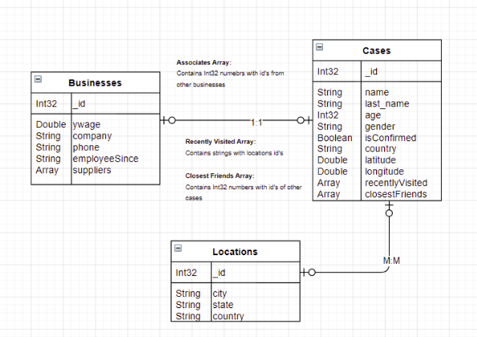
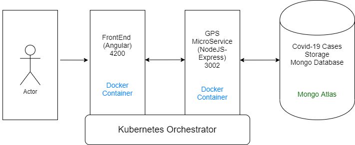
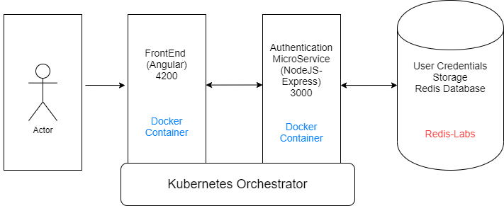
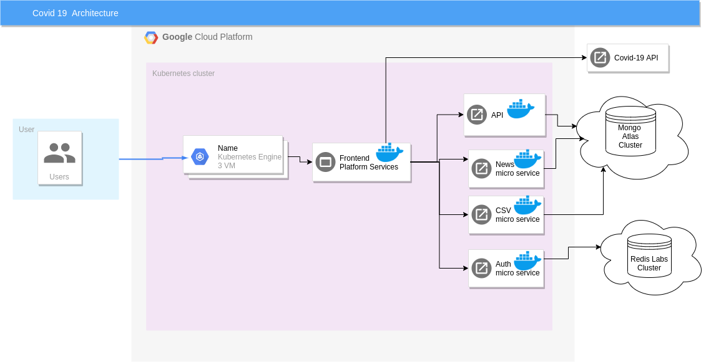

# TC3041 Proyecto Final Primavera 2020

# Covid-19DB
---

##### Integrantes:
1. *Daniel Charua* - *A01017419* - *CSF*
2. *Roberto Alejandro Gutiérrez Guillén* - *A01019608* - *CSF*
3. *Eduardo Badillo Álvarez* - *A01020716* - *CSF*
4. *Sergio Hernandez Castillo* - *A01025210* - *CSF*

---
## 1. Aspectos generales

Las orientaciones del proyecto se encuentran disponibles en la plataforma **Canvas**.

Este documento es una guía sobre qué información debe entregar como parte del proyecto, qué requerimientos técnicos debe cumplir y la estructura que debe seguir para organizar su entrega.

### 1.1 Requerimientos técnicos

A continuación se mencionan los requerimientos técnicos mínimos del proyecto, favor de tenerlos presente para que cumpla con todos.

* El equipo tiene la libertad de elegir las tecnologías de desarrollo a utilizar en el proyecto, sin embargo, debe tener presente que la solución final se deberá ejecutar en una plataforma en la nube. Puede ser  [Google Cloud Platform](https://cloud.google.com/?hl=es), [Azure](https://azure.microsoft.com/en-us/) o [AWS](https://aws.amazon.com/es/free/).
* El proyecto debe utilizar al menos dos modelos de bases de datos diferentes, de los estudiados en el curso.
* La solución debe utilizar una arquitectura de microservicios. Si no tiene conocimiento sobre este tema, le recomiendo la lectura [*Microservices*](https://martinfowler.com/articles/microservices.html) de [Martin Fowler](https://martinfowler.com).
* La arquitectura debe ser modular, escalable, con redundancia y alta disponibilidad.
* La arquitectura deberá estar separada claramente por capas (*frontend*, *backend*, *API RESTful*, datos y almacenamiento).
* Los diferentes componentes del proyecto (*frontend*, *backend*, *API RESTful*, bases de datos, entre otros) deberán ejecutarse sobre contenedores [Docker](https://www.docker.com/) y utilizar [Kubernetes](https://kubernetes.io/) como orquestador.
* Todo el código, *datasets* y la documentación del proyecto debe alojarse en este repositorio de GitHub siguiendo la estructura que aparece a continuación.

### 1.2 Estructura del repositorio
El proyecto debe seguir la siguiente estructura de carpetas:
```
- / 			        # Raíz de todo el proyecto
    - README.md			# Archivo con los datos del proyecto (este archivo)
    - frontend			# Carpeta con la solución del frontend (Web app)
    - backend			# Carpeta con la solución del backend (CMS)
    - api			# Carpeta con la solución de la API
    - datasets		        # Carpeta con los datasets y recursos utilizados (csv, json, audio, videos, entre otros)
    - dbs			# Carpeta con los modelos, catálogos y scripts necesarios para generar las bases de datos
    - docs			# Carpeta con la documentación del proyecto
        - stage_f               # Documentos de la entrega final
        - manuals               # Manuales y guías
```

### 1.3 Documentación  del proyecto

Como parte de la entrega final del proyecto, se debe incluir la siguiente información:

* Justificación de los modelo de *bases de datos* que seleccionaron.
* Descripción del o los *datasets* y las fuentes de información utilizadas.
* Guía de configuración, instalación y despliegue de la solución en la plataforma en la nube  seleccionada.
* Documentación de la API. Puede ver un ejemplo en [Swagger](https://swagger.io/). 
* El código debe estar documentado siguiendo los estándares definidos para el lenguaje de programación seleccionado.

## 2. Descripción del proyecto

Nuestro proyecto consiste en el desarrollo de una aplicación web para cargar datos, monitorear, analizar y registrar casos de COVID-19. 

## 3. Solución

A continuación aparecen descritos los diferentes elementos que forman parte de la solución del proyecto.

### 3.1 Modelos de *bases de datos* utilizados

Los modelos de bases de datos utilizados son los siguientes:

   #### MongoDB
   
   Una base de datos NoSQL basada en documentos, para registrar los casos de Covid-19. 
   
   Utilizamos MongoDB por la facilidad de uso del framework de agregación cuando se realizan consultas y por su servicio acccesible de 
   hosting de la base de datos en Mongo Atlas.
   
   *El JSON Schema de la base de datos se encuentra en el folder "database".*



El patrón de modelación de nuestra base de datos es referencial. Es decir, en vez de embeber subdocumentos como parte de una colección para denotar relación se guardan referencias en los documentos a documentos en otras colecciones. 

* La colección Cases guarda una relación referencial con Businesses 1:1 (Businesses._id)<->(Cases._id)
* La colección Cases guarda una relación referencial con Locations 1:1 (Cases._id)<->(Locations._id)
* La colección Cases guarda una relacion referencial con si misma 1:N Vector(closestFriends[])*->(Cases._id)
* La colección Businesses guarda una relación referencial con si misma 1:N Vector(suppliers[])*->(Businesses._id)
   
#### Redis 
Una base de datos NoSQL basada en el esquema llave-valor, para gestionar las sesiones de usuario en la aplicación.

Utilizamos Redis por el manejo nativo de expiración de los registros, al ser automatizada la duración de sesión de los usuarios se evita tener que desarrollar ese funcionamiento a nivel aplicación. 
   
### 3.2 Descripción de los datasets

El dataset fue producido en una aplicación de generación de datos JSON con el propósito de almacenar una cantidad realista de gente probada por COVID-19 (aproximadamente diez millones de casos). 

Los campos del dataset son los siguientes:
* Nombre
* Apellidos
* Edad 
* Sexo
* Confirmado
* Coordenadas
* Lista de amigos
* Lista de amigos recientemente visitados

Para la generación de gráficas utilizamos una API que utiliza un repositorio oficial del conteo de cifras para poder desplegar datos fidedignos.

### 3.3 Arquitectura de la solución

Los dos modelos de bases de datos se están ejecutando en servidores externos, respectivamente Atlas y Redis-labs.

#### MongoDB


La base de datos de Mongo esta configurada como una arquitectura de desarrollo. Es decir, consiste de un solo replica set de 3 nodos y otro replica set de configuración. 

#### Redis



La base de datos de Redis está configurada como la arquitectura default de alta disponibilidad de Redis. Es decir, consiste de un cluster con un nodo maestro y nodos esclavos para proveer redundancia mediante replicación. 

#### Diagrama global

El modelo siguiente muestra las interacciones de los dos microservicios expuestos anteriormente integrados con el microservicio de carga de csvs, el microservicio front de QR Code y el API externo para consultar las cifras oficiales de Covid-19.



### 3.4 Frontend

El frontend para este proyecto está directamente basado del frontend que se creó para la Tarea 3 de esta materia. Entonces, este frontend también fue diseñado en Angular.

El front también ofrece unos modulos de operaciones de visualización básicas para el usuario:
* Ver datos reales a nivel global con la api [covid](https://covid19api.com/).
* Registrarse a la aplicación.
* Ingresar a la aplicación.
* Operaciónes CRUD en casos,  negocios y localidades.
* La función de visualizar las tablas de casos, negocios y localidades.
* Cargar múltiples casos a la vez con la función de CSV.
* La función de escanear el código QR fue desarrollado con Angular y opera conjuntamente con los demás componentes del Front.
* La función de ver gráfica con datos reales de la tasa de infección en México con la api [covid][(https://covid19api.com/).
* La función de visualizar el mapa de coordenadas de los casos por Covid-19 (experimental, son ficticias).

#### 3.4.1 Lenguaje de programación

Los lenguajes de programación utilizados para el desarrollo del frontend fueron: HTML, SCSS y TypeScript.

#### 3.4.2 Framework

El framework utilizado para el desarrollo del frontend fue: [Angular](https://angular.io). Es un framework de código abierto para el desarrollo de aplicaciones web de una sola página desarrollado por Google. 

#### 3.4.3 Librerías de funciones o dependencias

Para el diseño de las pantallas botones y assets de la aplicación se utilizó [Bootstrap](https://getbootstrap.com) con sus modificaciones necesarias para una mejor visualización y UI.

Aparte de Bootstrap, se utilizó HTTP module. Es un dependencia que te permite hacer peticiones http y procesarlas para que puedas ocupar la información que necesites de las bases de datos que procesa el backend y los microservicios.

### 3.5 Backend

El backend esta compuesto de los microservicios y APIs expuestas en el diagrama global, estos son:
* La API principal para hacer operaciónes CRUD sobre nuestra base de datos en mongo (Puerto 8081)
* Microservicio de autenticación en Node para autenticar credenciales de usuario (Puerto 3000).
* Microservicio de carga de archivos en Node para subir archivos tipo csv al sistema (Puerto 3001).
* Microservicio de noticias en Node, para desplegar noticias relacionadas con el Covid-19 (Puerto 3002).

Cada microservicio y la API están almacenados en un [Docker](https://www.docker.com/) container dentro de [GCP](https://cloud.google.com/) y son orquestrados por [Kubernetes](https://kubernetes.io/).

#### 3.5.1 Lenguaje de programación
Los lenguajes de programación utilizados para el desarrollo del backend fueron: JavaScript.
#### 3.5.2 Framework
El framework utilizado fue [Node-js Express](https://expressjs.com/) para agilizar el desarrollo web de Node.

` npm install express --save`

#### 3.5.3 Librerías de funciones o dependencias
Las dependencias utilizadas son los modulos que Node precisa para su integración en el desarrollo. 
Se instalan los modulos utilizando el package manager en el folder de node local.

` npm install`

Se puede ver a detalle las dependencias de node [aqui](https://nodejs.org/en/docs/meta/topics/dependencies/).

### 3.6 API
API RESTful en Node que se conecta al cluster de Mongo Atlas para realizar todas las operaciones CRUD (Puerto 8081).

#### 3.6.1 Lenguaje de programación
Los lenguajes de programación utilizados para el desarrollo e integración de las APIS fueron: JavaScript
#### 3.6.2 Framework
El framework utilizado fue [Node-js Express](https://expressjs.com/) 

#### 3.6.3 Librerías de funciones o dependencias
- [Mongoose](https://mongoosejs.com/) para conectarse a MongoDB.
- [body-parser](https://expressjs.com/en/resources/middleware/body-parser.html)
-  [cors](https://www.npmjs.com/package/cors)

####  3.6.4 Endpoints
##### Cases
- GET : cases/getALL -> Se regresa un JSON con los primeros 100 elementos de la colección, para eficientizar el tiempo de respuesta
- PUT: cases/add ->  se agrega un objeto nuevo a la colección, se espera un objeto JSON con los datos del objeto nuevo
- DELETE: cases/delete/:id ->  se borra un objeto con el id en el URL de la colección
- PUT: cases/update/:id ->  se edita el objeto con el id de la URL de la colección, se espera un objeto JSON con los datos del objeto
- GET : cases/unwind -> Se regresa un JSON con el resultado del query unwind
- GET : cases/geoNear -> Se regresa un JSON con el resultado del query neoNear
- GET : cases/facet -> Se regresa un JSON con el resultado del query facet
- GET : cases/graphLookup -> Se regresa un JSON con el resultado del query graphLookup

##### Buisnesses
- GET : buisnesses/getALL -> Se regresa un JSON con los primeros 100 elementos de la colección, para eficientizar el tiempo de respuesta
- PUT: buisnesses/add ->  se agrega un objeto nuevo a la colección, se espera un objeto JSON con los datos del objeto nuevo
- DELETE: buisnesses/delete/:id ->  se borra un objeto con el id en el URL de la colección
- PUT: buisnesses/update/:id ->  se edita el objeto con el id de la URL de la colección, se espera un objeto JSON con los datos del objeto
- GET : cases/lookup -> Se regresa un JSON con el resultado del query lookup

##### Locations
- GET : locations/getALL -> Se regresa un JSON con los primeros 100 elementos de la colección, para eficientizar el tiempo de respuesta
- PUT: locations/add ->  se agrega un objeto nuevo a la colección, se espera un objeto JSON con los datos del objeto nuevo
- DELETE: locations/delete/:id ->  se borra un objeto con el id en el URL de la colección
- PUT: locations/update/:id ->  se edita el objeto con el id de la URL de la colección, se espera un objeto JSON con los datos del objeto

## 3.6 Pasos a seguir para utilizar el proyecto

### Para ejecutarlo local

1. Clonar el repositorio de GitHub

`git clone https://github.com/tec-csf/tc3041-pf-primavera-2020-equipo01`

2. Cambiarse a la carpeta del backend del proyecto

`cd tc3041-pf-primavera-2020-equipo01/api`

3. Instalar las dependencias de NodeJs para el backend

`npm install`

4. Iniciar la app del backend de la API Rest

`npm start`

5. Abrir otra terminal y cambiarse a la carpeta del microservicios/auth

6. Cambiarse a la carpeta del backend del proyecto

`cd tc3041-pf-primavera-2020-equipo01/microservices/auth`

7. Instalar las dependencias de NodeJs para el backend

`npm install`

8. Iniciarel microservicio auth en Redis

`npm start`

9. Abrir otra terminal y cambiarse a la carpeta del microservicios/csv

10. Cambiarse a la carpeta del backend del proyecto

`cd tc3041-pf-primavera-2020-equipo01/microservices/csv`

11. Instalar las dependencias de NodeJs para el backend

`npm install`

12. Iniciar el microservicio de carga de csv

`npm start`

13. Abrir otra terminal y cambiarse a la carpeta del frontend del proyecto

`cd tc3041-pf-primavera-2020-equipo01/frontend`

14. Instalar las dependencias de NodeJs para el frontend

`npm install`

15. Iniciar el frontend de la aplicación.

`ng serve`

16. Abrir el navegador en el puerto 4200 para ver la aplicación funcionando

http://localhost:4200

### Para ejecutarlo en la nube (Google Cloud)

#### En GCLOUD console

1. Entra a la consola de Google Cloud Platform (GCP) 

https://console.cloud.google.com

2. Crea un proyecto en el cual se desplegará la aplicación

3. Abre la terminal de GCP

4. Clona el repositorio de Gitub

`git clone https://github.com/tec-csf/tc3041-pf-primavera-2020-equipo01`

5. Dentro de la plataforma entra a Compute/Kubernetes Engine y crea un nuevo cluster

#### En tu computadora (API)

1. Clonar el repositorio de github

`git clone https://github.com/tec-csf/tc3041-pf-primavera-2020-equipo01`

2. Cambiarse a la carpeta del backend del proyecto

`cd tc3041-pf-primavera-2020-equipo01/api`

3. Crear la imagen de la api usando el comando

`docker build . --tag gcr.io/[id del proyecto de GCP]/api`

4. Dar push a la imagen de la api usando el comando

`gcloud docker -- push gcr.io/[ID del proyecto de GCP]/api`


5. Crea la conexión con el cluster creado previamente

`gcloud container clusters get-credentials [Nombre del cluster] --zone [Zona del cluster] --project [ID del proyecto de GCP]`

6. Desplegar la aplicación en el cluster

`kubectl apply -f backendDeployment.yaml`

7. Comprobar que el pod está funcionando correctamente (El Status debe ser Running)

`kubectl get pods`

8. Obtener la dirección IP externa y el puerto del backend-service

`kubectl get service`

#### En tu computadora (auth)

1. Clonar el repositorio de github

`git clone https://github.com/tec-csf/tc3041-pf-primavera-2020-equipo01`

2. Cambiarse a la carpeta del backend del proyecto

`cd tc3041-pf-primavera-2020-equipo01/auth`

3. Crear la imagen del microservicio auth usando el comando

`docker build . --tag gcr.io/[id del proyecto de GCP]/auth`

4. Dar push a la imagen del microservicio auth usando el comando

`gcloud docker -- push gcr.io/[ID del proyecto de GCP]/auth`

5. Desplegar la aplicación en el cluster

`kubectl apply -f authMicroDeploy.yaml`

6. Comprobar que el pod está funcionando correctamente (El Status debe ser Running)

`kubectl get pods`

7. Obtener la dirección IP externa y el puerto del backend-service

`kubectl get service`

#### En tu computadora (csv)

1. Clonar el repositorio de github

`git clone https://github.com/tec-csf/tc3041-pf-primavera-2020-equipo01`

2. Cambiarse a la carpeta del backend del proyecto

`cd tc3041-pf-primavera-2020-equipo01/csv`

3. Crear la imagen del microservicio csv usando el comando

`docker build . --tag gcr.io/[id del proyecto de GCP]/csv`

4. Dar push a la imagen del microservicio csv usando el comando

`gcloud docker -- push gcr.io/[ID del proyecto de GCP]/csv`

5. Desplegar la aplicación en el cluster

`kubectl apply -f CSVmicroDeploy.yaml`

6. Comprobar que el pod está funcionando correctamente (El Status debe ser Running)

`kubectl get pods`

7. Obtener la dirección IP externa y el puerto del backend-service

`kubectl get service`

#### En tu computadora (FRONTEND)

1. Cambiarse a la carpeta del frontend del proyecto

`cd ../frontend`

2. Modificar el siguiente archivo: src/app/enviroments/enviroments.prod.ts

Cambiar la rutas de conexión con las IPS de los clusters:
```typescript
route: String = 'http://[IP externa del backend-service]:[Puerto del backend-service]'; 
```
3. Crear la imagen del frontend usando el comando

`docker build . --tag gcr.io/[ID del proyecto de GCP]/frontexp-image`

4. Dar push a la imagen del frontend usando el comando

`gcloud docker -- push gcr.io/[ID del proyecto de GCP]/frontexp-image`

5. Desplegar la aplicación en el cluster

`kubectl apply -f frontendDeployment.yaml`

6. Comprobar que el pod está funcionando correctamente (El Status debe ser Running)

`kubectl get pods`

7. Obtener la dirección IP externa y el puerto

`kubectl get service`

8. Acceder a la aplicación en un browser

`http://[IP externa del frontend-service]:[Puerto del frontend-service]`

## 4. Referencias

1. [Conexión con Mongoose](https://mongoosejs.com/docs/guide.html)
2. [Crear un contenedor de docker con Angular](https://scotch.io/tutorials/create-a-mean-app-with-angular-2-and-docker-compose)
3. [Crear un contenedor de docker con Node.js](https://nodejs.org/en/docs/guides/nodejs-docker-webapp/)
4. [Implementar una aplicación web en contenedor](https://cloud.google.com/kubernetes-engine/docs/tutorials/hello-app)
5. [Pushing and pulling images](https://cloud.google.com/container-registry/docs/pushing-and-pulling)
6. [API de Covid](https://covid19api.com/).
